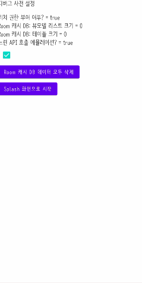
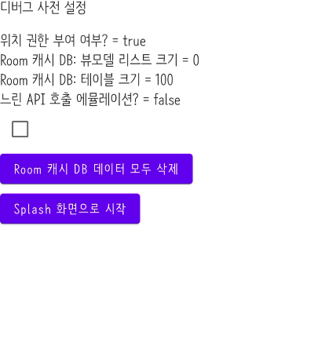
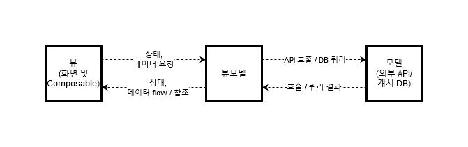
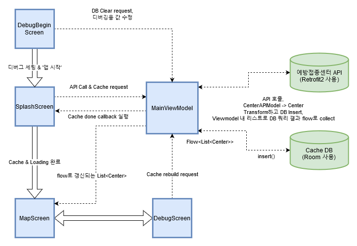
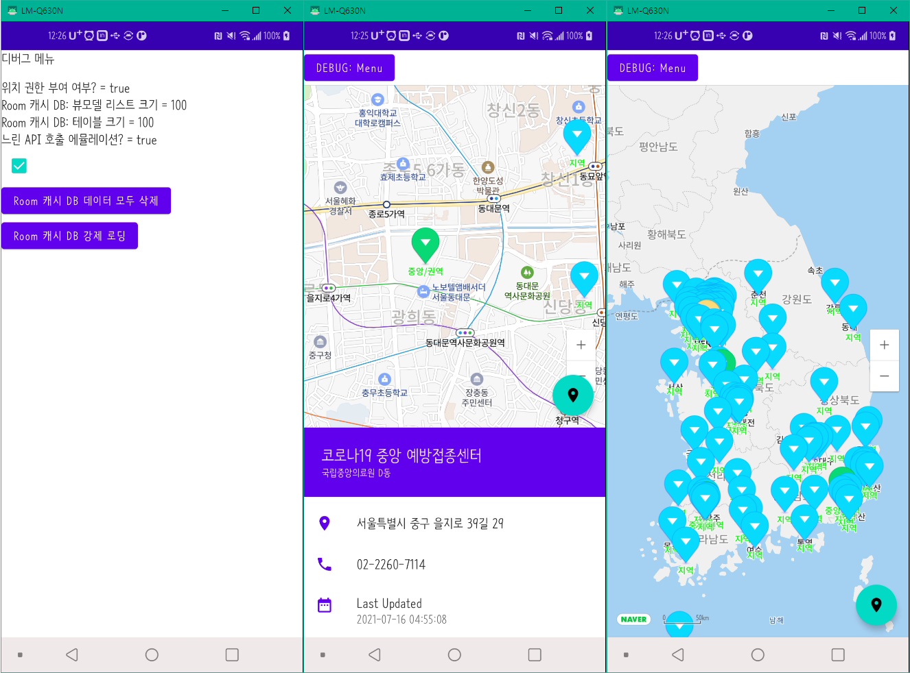

covid-map-service-compose
===
<h4>공공데이터활용지원센터 API를 활용한 코로나19 예방접종센터 지도 어플리케이션 프로젝트</h4>
<h4>2일의 기간동안 진행한 안드로이드 단기 개발 프로젝트입니다.</h4>



---

### ToC

1. [기능](#기능)
2. [실행](#실행)
3. [전체 앱 구성](#structure)
    1. [뷰 / 화면](#view)
    2. [뷰모델](#viewmodel)
    3. [데이터 레이어 / 모델](#model)
4. [포스트모템 / 트러블슈팅](docs/writeup.md)
5. [스크린샷](#스크린샷)

---

# 기능

- [x] Jetpack Compose를 활용한 레이아웃 구성
- [x] [Jetpack Compose Naver Map 라이브러리](https://github.com/fornewid/naver-map-compose)를 활용한 지도 뷰어 및 예방접종 센터별 마커 생성
- [x] 마커의 centerType 필드에 따른 색상 구분
- [x] Retrofit2를 활용한 공공데이터활용지원센터 API 호출
- [x] Jetpack Room를 활용한 API 호출 데이터의 캐싱 / 저장
- [x] Coroutine Flow를 활용해 요구사항에 맞게끔 Progressbar 갱신 및 캐시 DB 데이터로부터의 뷰모델 비동기 갱신
- [x] Hilt를 사용한 뷰모델 DI의 구현 (+ IDE 내에서의 Composable 프리뷰/테스트용 더미 뷰모델의 구현)
- [x] 지도 상 마커의 선택 / 터치와 그에 맞는 기능 구현
- [x] FloatingActionButton을 활용한 '현재 위치로 이동' 기능
- [x] BottomSheetScaffold을 활용한 접종센터 정보 안내창 & 가시성 제어
- [x] 테스트의 편의를 위한 디버그 화면

---

# 실행

프로젝트를 실행하기 위해선 API 키를 설정해야 합니다.

이를 위해서, 프로젝트 루트 폴더 (`현재 읽고계신 README.md와 같은 폴더`)에 `secrets.properties` 파일을 만들고 다음과 같이 설정해주십시오:
```properties
# secrets.properties
NAVER_API_CLIENTID = "네이버 AI-NAVER API CLIENT ID"
CENTERS_API_KEY = "코로나19예방접종센터 조회서비스 API 키 (decoding)"
CENTERS_API_KEY_ENCODED = "코로나19예방접종센터 조회서비스 API 키 (encoding)"
```

다음과 같은 파일 구조가 되면, `app/build.gradle` 에서 자동으로 API 키를 읽어들이고 소스에서 사용하게 됩니다:
```
ㄴ <프로젝트 루트>
    ㅏ secrets.properties << 확인!
    ㅏ README.md
    ㅏ build.gradle
    ㅏ .....
```

네이버 API의 Client ID는 [네이버 콘솔을 통해 확인하실 수 있습니다.](https://guide.ncloud-docs.com/docs/naveropenapiv3-application)

이후 프로젝트를 Android Studio에서 빌드하고 실행하면 다음과 같은 초기 설정 화면이 나옵니다:



여기서는 현재 DB의 상황과 여러 상태를 확인할 수 있고, 체크박스를 통해 '느린 네트워크 시뮬레이션'을 토글하는 등 여러 디버그 기능을 수행하실 수 있습니다. 마지막으로 `Splash 화면으로 시작` 버튼을 누르면 요구사항에 맞게 Splash 화면으로 이동해 진행되고, 데이터 로딩 뒤 Map 화면으로 이동함을 알 수 있습니다.

---

<a name="structure"/>

# 전체 앱 구성



전반적으로 이 프로젝트는 MVVM을 활용해, 뷰(UI)에 필요한 상태 데이터를 공유된 뷰모델에 저장하고, 뷰모델이 DB와 같은 외부 데이터에 접근하는 역할을 함으로써 각 UI 요소들간의 데이터 관련 종속성을 줄였습니다.



이러한 구조 덕분에, 각 화면은 뷰모델에 데이터를 (갱신)요청을 하고 갱신된 뷰모델 내 데이터를 참조하거나, 반환된 데이터를 통해 UI 요소의 상태로 사용하는 방식으로 MVVM 디자인 패턴을 따라 작동하게 되었습니다.

<a name="view"/>

### 뷰 / 화면

각 화면(Composable)은 State hoisting (더 나아가, MVVM)의 원칙에 따라 외부 데이터와 상태를 가지지 않는, 즉 Stateful하지 않음을 목적에 두고 구현했습니다. 따라서, CoroutineScope와 같이 데이터와 관련되지 않은 내부 데이터를 제외한 거의 모든 데이터를 Hilt DI로 제공되는 뷰모델인 MainViewModel에 대신 저장하고 접근함으로써, 앱과 관련된 모든 상태를 화면의 여러 하위 요소들에서 관리하지 않고 한 곳에서 관리하는 State hoisting의 원칙을 염두에 두고 구현했습니다.

<a name="viewmodel"/>

### 뷰모델

위 다이어그램과 같이, MainViewModel은 앱의 상태를 담으므로 모든 화면 (그리고 하위 Composables)에서 공유되어야 합니다. 따라서, 뷰모델의 쉬운 전달을 위해 Hilt에서 제공하는 DI 기능을 이용해 명시적으로 하위 Composable에 뷰모델을 전달하지 않아도 되게끔 구현할 수 있었습니다.

<a name="model"/>

### 데이터 레이어 / 모델

이 프로젝트에 사용되는 데이터의 소스로 다음과 같은 저장소를 사용합니다:
* API 결과를 캐싱하는 목적인 앱 내부서 관리하는 Room 캐시 DB
* API 결과를 제공하는 공공데이터활용지원센터의 코로나19 예방접종소 API

뷰모델은 먼저 앱 실행시 내부 캐시 DB가 비어 있는 등의 이유로 DB의 갱신이 필요하다면, API에 데이터 요청을 위한 호출을 한 뒤, 받은 접종센터의 리스트를 Transform해 요구사항에 맞춰 DB에 insert 쿼리를 통해 넣는 과정을 거칩니다.

그 뒤, 쿼리를 통해 Room DB에서 `flow<List<Center>>` 형태로 반환되는 접종센터의 데이터를 collect함으로써 비동기적인 DB 상의 데이터 흐름을 잡고, 이를 collect할 때 마다 내부의 list로 copy하고 다른 뷰에 제공함으로써 데이터가 사용됩니다.

한편, 정석적인 MVVM이라면 두 저장소 모두 비동기적으로 데이터가 갱신되는것을 flow 등을 이용해 리스닝 (옵저빙?) 해야 합니다. 하지만, 코로나19 예방접종소 API는 flow의 일반적인 사용예 (i.e.: 빠른 주기로 새로운 게시글이 올라오거나 수정되는 게시판 서비스 등)와는 부합하게, 예방접종소가 빠른 주기로 건축되거나 철거되지 않기에, API로부터 주기적으로 바뀌는 상황에 맞춰 리스닝을 할 이유가 없다는 판단, 앞서 언급했듯이 캐시 DB를 재생성/갱신 할 때에만 API를 새로 호출하는 방식을 택했습니다.

만약 (*그러면 정말로 안되겠지만*) 이번 코로나 변이가 심해져, 빠른 주기로 예방접종소가 생기고 사라져서 API 또한 빠른 주기로 갱신되는 상황이 온다면, 위의 방법 말고 주기적으로 API 호출하고 딜레이를 가지는 코루틴 플로우를 실행시켜 주기적으로 새 API 데이터를 가져오는 방식으로 기능을 확장 할 수 있을겁니다.

---

[포스트모템 / 트러블슈팅](docs/writeup.md)
===
[내용이 길어지게 되었으므로 별도의 Markdown 문서로 이동하였습니다!](docs/writeup.md)

<a name="screenshots"/>

# 스크린샷


