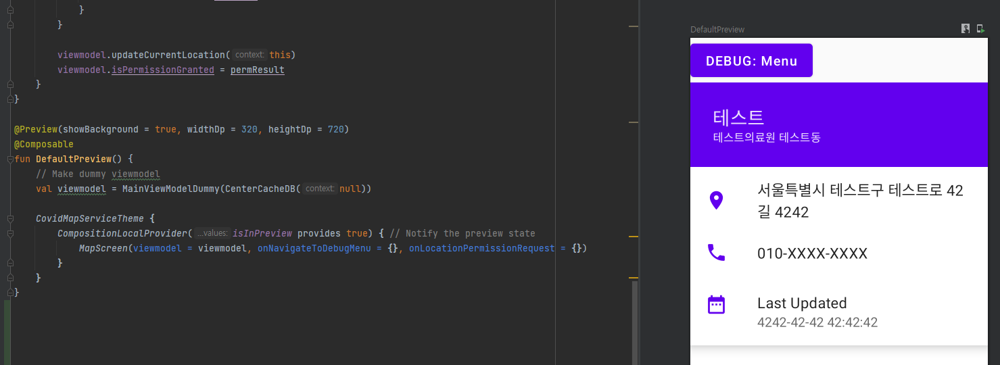
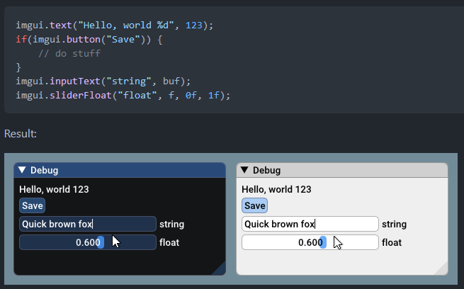

### ToC
[뒤로가기](../README.md)
1. [트러블슈팅](#troubleshoot)
2. [포스트모템](#postmortem)

<a name="troubleshoot"/>

# 트러블슈팅

### Progressbar: Progress와 데이터 처리 병행

Progressbar 요구조건을 만족하기 위해, 처음에는 진행상황이 0부터 1까지 2초동안 가게끔 delay를 주며 진행상황을 갱신해나가는 매우 간단한 카운터 코루틴과 API 호출을 진행하는 IO 코루틴을 실행하는 것으로 구현하려 했습니다.

그러면서 또 다른 요구조건인 `진행상황이 80%에서 API 로딩이 되지 않았다면 대기하고, 대기 종료 후 0.7초동안 100%가 되게끔 진행해라` 를 구현하지 못한다는 문제를 직면했습니다.

따라서 이를 위해, 카운터 로직을 수정해 진행상황이 80% 이상이고 아직 데이터가 로딩되지 않았으면 (이는 코루틴 스코프 밖에서 플래그 변수를 선언함으로써 API를 호출하는 코루틴과 진행상황을 갱신하는 코루틴에서 이를 참조하고 조작하는것으로 구현했습니다.) 진행상황을 갱신하는 코루틴 내에서 `while` 루프를 이용해 계속 80%의 진행상황을 emit하고 대기하는 busy waiting을 진행하는 것으로 구현했습니다.

마지막으로 진행상황을 갱신하는 과정에서 실제 코드 실행시간을 고려하지 않고 정적인 양만큼만 진행상황을 증가시켜서 그런지, Progressbar가 2초에서 벗어난 시간동안 증가되는 문제가 있었습니다. 이는 다음과 같이 진행상황을 갱신하는 루프 내에서 카운터 변수를 증가시키는 양을 정적으로 계산함으로써 해결할 수 있었습니다:
```kotlin
// 진행상황 progress가 0부터 1(=100%)까지 증가되는 로직
val progressDelay: Long = 10 // 10ms의 갱신 딜레이
var progressTargetMillis: Long = 2000 // 2000ms = 2초동안 갱신하기를 원한다
val progressTargetPercent = 1f // 100%가 될 때 까지 증가

var progress = 0f // 현재 진행상황
var progressStepNum: Long // = progressTargetMillis / progressDelay
var progressStep: Float // = (progressTargetPercent - progress) / progressStepNum

var timeElapsedRef = System.currentTimeMillis()
var timeElapsed: Long
while (progress < 1f) {
    delay(progressDelay)
    emit(Pair(progress, false))

    ........

    /*
        다음은 정적으로 progress를 증가하는 코드이다. 이는 실제 루프 내의 코드 실행시간을 고려하지 않기에 원하는 시간 내에 진행상황을 모두 증가시키지 못한다:
        progress += progressStep
    */

    // 다음은 동적으로 progress를 증가하는 코드이다.
    // 루프 내에서 지난 시간을 기반으로 progress의 증가량을 조정하므로 더욱 정확한 시간내에 progress가 100%에 도달하게 된다.
    timeElapsed = System.currentTimeMillis() - timeElapsedRef
    progressStepNum = max(progressTargetMillis - timeElapsed, 1) / progressDelay
    progressStep = (progressTargetPercent - progress) / max(progressStepNum, 1)
    progress += progressStep
}
```

### 뷰모델과 Jetpack Compose 프리뷰, 테스트용 API 처리 딜레이 시뮬레이션

저는 요구사항에 맞춰 기능을 구현하면서 수많은 테스트를 거치게 되었습니다.



이러한 테스트를 위해 가장 많이 사용된 기능은 역시 Jetpack Compose의 `@Preview` 기능인데, 위 사진과 같이 화면 등을 구성하는 `Composable`을 안드로이드 스튜디오 IDE 내에서 렌더링된 결과를 미리 볼 수 있다는 점에서 많은 도움이 되었습니다.

하지만 hilt 뷰모델을 사용하게되면서 문제에 마주쳤는데, hilt는 런타임에 앱이 시작되면서 생성한 뷰모델을 주입시키는 방식으로 작동하기에, 프리뷰 기능을 통해 뷰모델이 주입되는 Composable을 미리보기 하면 초기화가 되지 않은 뷰모델이 주입되기에 오류가 나서, 미리보기 기능이 작동하지 않는다는 문제입니다.

이 문제를 해결하기 위해 저는 실제 사용되는 뷰모델 클래스인 MainViewModel을 상속받아 별다른 기능을 하지 않는 '더미' 뷰모델 클래스를 정의했고, 이 클래스의 객체를 프리뷰 함수에서 미리보기를 할 Composable에 뷰모델로 넘겨주어, 문제를 해결할 수 있었습니다.

한편, Splash 화면에서 주어진 요구사항 중 `API 로딩이 완료되지 않으면 80%에서 대기하기` 라는 기능을 구현하면서, 또 다른 문제(?)를 직면했습니다. 한국의 빠른 인터넷 속도 덕에 API 호출 속도가 너무 빨라 80%에서 대기할 필요가 없이 바로 2초 동안 진행상황이 100%로 되는 상황이었습니다.

따라서, API 대기 기능을 테스트하기 위해서 저는 1페이지부터 10페이지까지의 데이터를 받아오기 위해 페이지별로 API를 호출한 뒤, API를 호출하는 코루틴에서 `delay()`문을 사용해 느린 네트워크를 재현하는 테스트 기능을 추가함으로써 원활한 테스트를 할 수 있었습니다:
``` kotlin
<코루틴 스코프 내부에서...>
// 1페이지부터 pages까지 페이지별로 API 호출
for (i in 1..pages) {
    inst.getCenters(page = i).enqueue(object: Callback<CenterAPIResponse> {
        override fun onResponse(
            call: Call<CenterAPIResponse>,
            response: Response<CenterAPIResponse>
        ) {
            // API 결과 데이터 처리 //
        }
        override fun onFailure(call: Call<CenterAPIResponse>, t: Throwable) {
            // API 실패 데이터 처리 //
        }
    })

    // 페이지 API 호출 완료...
    // 이제 각 페이지별 API 호출 사이에 코루틴 딜레이를 줌으로써 느린 네트워크를 시뮬레이션 할 수 있다
    if (emulateSlowAPICall)
        delay(500)
}
...
```

### Room DB 데이터 타입 문제

코틀린에서의 Room DB는 자바와 동일하게 `data class()` 에 `@Entity` 어노테이션을 붙이는것으로 DB 테이블의 요소임을 선언할 수 있습니다. 그러면서 Room DB가 클래스 멤버들을 '자동으로' DB와 맞는 타입으로 변환하려 하는데, 제 접종센터 엔티티 클래스는 네이버에서 제공하는 `LatLng`, 색을 표현하는 `Color` 객체의 인스턴스를 멤버로 가지게 되어 문제가 되었습니다.

`LatLng` 객체와 같은 경우에는 문서를 찾아보며 `@TypeConverter` 어노테이션이 들어간 함수로 DB에서 지원하는 타입으로 변환해 DB에 저장할 수 있었습니다. 하지만, `Color` 객체는 왜인진 모르겠지만 자체적으로 `Long` 타입으로 변환되어 DB와 맞지 않는 타입으로 에러를 출력하는 동시에 `@TypeConverter` 또한 무시하는 현상을 확인할 수 있었습니다. (아마 이는 Color 객체가 내부적으로 ULong 형태인 `0xRRGGBBAA`로 표현되어서 그런 것 같습니다.)

결과적으로는 `Color` 객체 멤버는 런타임시 centerType값에 따라 정해지기 때문에, `@Ignore`를 통해 DB에 저장하지 않기로 하고, 생성자를 사용해 주어진 centerType값에 따라 `when()` 구문을 통해 색상을 지정하는 방식으로 해결했습니다:
``` kotlin
// Converts Center type to (tint) color
fun centerTypeToColor (centerType: String): Color {
    return when (centerType) {
        "중앙/권역" -> Color.Transparent
        "지역" -> Color.Blue
        else -> Color.Magenta
    }
}
@Entity(tableName = DB_TABLE_NAME)
data class Center(
    @PrimaryKey(autoGenerate = true)
    ...
    val centerType: String,
    ...
    @Ignore
    val markerColor: Color, // Set inside of the constructor. No need to be stored within the DB
) {
    constructor(id: Int, pos: LatLng, address: String, centerName: String, facilityName: String, phoneNumber: String, updatedAt: String, centerType: String): this(id, pos, address, centerName, facilityName, phoneNumber, updatedAt, centerType, centerTypeToColor(centerType))
}
```

### API 반환 모델과 내부 DB 모델의 차이

다음과 같이 예방접종소 API의 결과로 반환되는 엔티티/모델은 실제로 사용되지 않는 정보를 담고, 위치 정보가 경도와 위도가 나뉘어 표현되는 등 바로 사용하기엔 비효율적이었습니다. 따라서, 캐시 DB 내의 예방접종소를 표현하는 모델은 다음과 같이 뷰모델과 뷰에서 바로 사용 가능한 형태를 가지고 있습니다:
``` kotlin
// 캐시 용도의 Room DB상의 접종센터 엔티티
// Center.kt
@Entity(tableName = DB_TABLE_NAME)
data class Center(
    @PrimaryKey(autoGenerate = true)
    val id: Int,
    val pos: LatLng, // LatLng는 @TypeConverter를 통해 "위도;경도" 형태로 인코딩되어 DB에 저장되고 읽어집니다. (data/CenterCacheDBAbstract.kt 참고)
    val address: String,
    val centerName: String,
    val facilityName: String,
    val phoneNumber: String,
    val updatedAt: String,
    val centerType: String,
    @Ignore
    val markerColor: Color, // Set inside of the constructor. No need to be stored within the DB
)
// API에서 반환하는 접종센터 엔티티
// CenterAPIEntities.kt
// https://www.data.go.kr/tcs/dss/selectApiDataDetailView.do?publicDataPk=15077586#/
data class CenterAPIModel(
    val id: Int,
    val centerName: String,
    val sido: String,
    val sigungu: String,
    val facilityName: String,
    val zipCode: String,
    val address: String,
    val lat: String,
    val lng: String,
    val createdAt: String,
    val updatedAt: String,
    val centerType: String,
    val org: String,
    val phoneNumber: String,
)
```
캐시된 데이터를 저장하는 Room DB상의 모델은 UI와 뷰모델에서 사용되는 데이터를 필요한 형식에 맞게 변환한 상태이므로, API 결과를 Room DB의 모델로 바꾸는 과정이 필요했습니다. 따라서, API에서 반환된 결과를 Room DB로 insert하는 과정에서 함수를 통해 Room DB의 모델로 변환시켰습니다:
```kotlin
// MainViewmodel.kt::updateAPICacheAndReturnFlow
.....
fun centerModelToCenter (response: CenterAPIModel): Center {
    return Center(
        id = response.id,
        pos = LatLng(response.lat.toDouble(), response.lng.toDouble()),
        address = response.address,
        centerName = response.centerName,
        facilityName = response.facilityName,
        phoneNumber = response.phoneNumber,
        updatedAt = response.updatedAt,
        centerType = response.centerType
    )
}
.....
CenterAPI.callAPI(
    onAPIPageDone = { page, res ->
        // onAPIPageDone 콜백은 각 페이지별로 API를 호출한 결과를 res 인자에 담아 호출됩니다.
        // 이때 res는 List<CenterAPIModel> 형태를 띄므로, 각 요소를 변환시켜 Room DB에 insert해주는 과정을 거칩니다:
        CoroutineScope(Dispatchers.IO).launch {
            for (res in res) {
                // centerModelToCenter (response: CenterAPIModel) -> Center
                cacheDB.insert( centerModelToCenter(res) )
            }
        }
    },
    .....
)
.....
```
이렇게 변환된 모델은 뷰모델에서 참조하거나 flow를 통해 비동기적으로 리스닝함으로써, 뷰모델을 참조하는 모든 UI 요소가 데이터를 사용할 수 있도록 설계하였습니다.

### API 키 노출 문제

과제를 위해 사용해야했던 Naver 지도 API와 예방접종센터 API는 API키를 쿼리에 붙이거나 AndroidManifest에 넘겨주는 형식으로 제출해야만 지도 서비스를 사용하거나 API 요청을 할 수 있었습니다.

하지만 API 키를 소스코드에 그대로 넣는다면, 이 리포지토리가 공개될 즈음에는 발급받은 API 키가 노출되어 악용되거나 다른 사람이 이용해 요금 폭탄을 먹을 수 있다는 문제를 API 기능을 구현하면서 발견했습니다.

이를 해결하기 위해 간단한 검색을 한 결과, 처음에는 `gradle.properties`에 API 키를 다음과 같이 넣고 `.gitignore`에 `gradle.properties`를 추가시켜서, 원격 레포지토리에는 그 파일이 올라가지 않되 로컬 레포지토리에는 그대로 남아있게끔 하는 기법을 사용해보려 했습니다:
``` properties
....
#Thu Aug 04 09:01:50 KST 2022
android.nonTransitiveRClass=true
kotlin.code.style=official
org.gradle.jvmargs=-Xmx2048m -Dfile.encoding\=UTF-8
android.useAndroidX=true
android.enableJetifier=true

NAVER_API_CLIENTID = "424242424242"
CENTERS_API_KEY = "https://www.youtube.com/watch?v=dQw4w9WgXcQ"
CENTERS_API_KEY_ENCODED = "https://www.youtube.com/watch?v=dQw4w9WgXcQ"
```
하지만 이러한 문제를 알았을 당시에는 이미 `gradle.properties`가 원격 리포지토리에 올라간 상태였기 때문에, 이 방법을 쓰기엔 부적합했습니다.
따라서 저는 그 다음으로 제시된 방법인 외부 파일인 `secrets.properties`에 API 키를 같은 형식으로 넣고, `app\build.gradle`에서 이를 로딩하는 방법을 쓰기로 했습니다:
``` gradle
// secrets.properties 파일에서 API 키 로딩
def secretProperties = new Properties()
secretProperties.load(new FileInputStream(rootProject.file("secrets.properties")))

android {
    ...
    defaultConfig {
        applicationId "com.vin.covidmapservice"
        minSdk 21
        targetSdk 32
        versionCode 1
        versionName "1.0"

        testInstrumentationRunner "androidx.test.runner.AndroidJUnitRunner"
        vectorDrawables {
            useSupportLibrary true
        }

        // 로딩한 API 키를 코틀린 내에서 BuildConfig.*, XML에서 string resource 형태로 사용할 수 있게끔 설정
        // https://itnext.io/hide-and-keep-your-api-key-out-of-github-repository-7e89cc4b159d
        buildConfigField 'String', "NAVER_API_CLIENTID", secretProperties['NAVER_API_CLIENTID']
        resValue 'string', "NAVER_API_CLIENTID", secretProperties['NAVER_API_CLIENTID']

        buildConfigField 'String', "CENTERS_API_KEY", secretProperties['CENTERS_API_KEY']
        resValue 'string', "CENTERS_API_KEY", secretProperties['CENTERS_API_KEY']
        buildConfigField 'String', "CENTERS_API_KEY_ENCODED", secretProperties['CENTERS_API_KEY_ENCODED']
        resValue 'string', "CENTERS_API_KEY_ENCODED", secretProperties['CENTERS_API_KEY_ENCODED']
    }
    ...
```

### Gradle 스크립트: 외부 dependencies

Room DB와 Jetpack Hilt를 사용하기 위해 dependencies에 추가하는 과정에서, 빌드 타임서 에러가 계속해서 걸리게 되었고, 프로젝트에 사용된 시간 중 대부분을 Gradle 스크립트의 트러블슈팅에 사용하게 되었습니다.
이는 결과적으로는 현재 사용중인 코틀린 버전과 각 dependencies의 버전과의 호환이 맞지 않아서 발생한 이슈였기에 허무했지만 별 탈 없이 해결할 수 있었습니다.

---

<a name="postmortem"/>

# 포스트모템

### Kotlin, Jetpack Compose 사용 후기

이전에 대학교 과제를 위해 안드로이드 프로젝트를 진행하면서 Java와 XML 레이아웃을 이용한 애플리케이션을 몇 번 만든적은 있어도, 코틀린과 Jetpack Compose를 이용해본 적은 하나도 없었습니다.

따라서 안드로이드 공부를 다시 재개하면서, 약 3주 동안 [코틀린 Koans](https://play.kotlinlang.org/koans), [안드로이드 공식 Codelabs](https://developer.android.com/codelabs/jetpack-compose-basics), 여러 블로그 포스트를 비롯한 수많은 리소스를 통해 코틀린과 코루틴 플로우, 컴포즈 등에 대해서 배울 수 있었고, 지금 보시고 계신 이 프로젝트와 같은 소규모 프로젝트를 진행할 수 있는 정도까지 도달할 수 있었습니다.

이전에 프로그래밍을 해본 경험, 특히 개인적으로 코틀린과 가장 비슷하다 생각하는 Java와 Python 언어를 개인적인 목적을 위해 접해본 적이 있었기에, 코틀린을 배우는 동안 친근감이 느껴져 익숙하고 재미있었습니다.

특히 Jetpack Compose를 배우며, XML와 다르게 코틀린 내부에서 직접 레이아웃을 짜는 패러다임은 제가 게임 개발 프로젝트를 진행하며 사용해왔던 UI 라이브러리인 [Dear ImGui](https://github.com/ocornut/imgui)의 [Immediate mode GUI 패러다임](https://en.wikipedia.org/wiki/Immediate_mode_GUI) 와 비슷하게 느껴져, 프로젝트를 진행하며 이를 익숙하게 사용할 수 있었습니다.



###### (ImGui 코드와 그와 상응되는 결과인 UI의 모습)

함수 형태로 구현된 UI 요소를 또 다른 UI 함수 속에서 호출해 '상속'하는 점, 콜백 등을 이용해 버튼 기능을 구현하는 점, 조건문을 이용해 함수를 호출하지 않음으로써 요소의 가시성을 제어하는 점 등 여럿 닯은 점이 많았지만, Jetpack Compose는 이에 그치지 않고 UI의 상태를 제어하는 `by remember { mutableStateOf(x) }` 와 같은 여러 방안을 제시해주어, 오히려 더 편하게 느껴졌습니다.

또한, `for (i in 0..42)`와 같이 코틀린의 강력한 Synthetic sugar의 지원을 통해서 이러한 편의성이 더욱 크게 느껴졌습니다.

### 아쉬웠던 Clean Architecture 시도

앞서 언급했듯, 코틀린을 이용한 앱 개발에 대해 배우던 도중 저는 [Clean Architecture](https://www.charlezz.com/?p=45391) 라는 코드 구조 관련 패러다임을 접할 수 있었습니다. 이는 프로젝트의 구조를 깔끔하게 만들고 확장의 용이성을 증가시킬 수 있어, 이를 따라서 프로젝트를 구성한다면 안드로이드 앱 개발을 배우는 저로썬 좋은 습관을 들일 수 있어보이기에 관심이 갈 수 밖에 없었습니다.

따라서, 이 패러다임에 따라 프로젝트를 진행하려 노력했지만, 결과적으로는 해커톤으로 습관을 들인 과제 마감기간 절반 이내에 최대한 빨리 코어 기능을 구현하고자 하는 성질 급한 마음에, 만족스럽지 못한 코드의 구조가 나온것 같아서 아쉬웠습니다. 특히 Room DB를 핸들링하는 부분을 리포지토리를 거치지 않고 바로 DAO를 받아 관련 함수를 제공하기에 너무 하나의 클래스로 압축시켜둔 것 같은 느낌이 들기에, 찜찜한 느낌이 없지 않아 있었습니다.

따라서, 다음에 이와 비슷한 프로젝트를 진행하게 된다면, 마감시간에 너무 신경쓰지 않고 좀 더 프로젝트 구조에 신경을 쓰고 코드를 짜는 식으로 진행해야겠다는 생각이 들었습니다.
